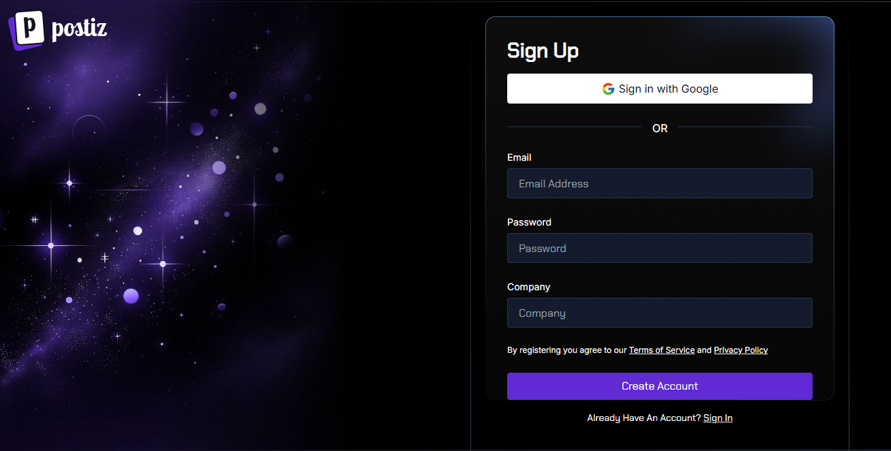

# Postiz CI/CD pipeline

Deploy Postiz server with CI/CD on Elestio

 
 

# Once deployed ...

You can open Postiz here:

    URL: https://[CI_CD_DOMAIN]
    login: "administrator"
    password: "[ADMIN_PASSWORD]"

You can open pgAdmin here:

    URL: https://[CI_CD_DOMAIN]:42623
    login: "[ADMIN_EMAIL]"
    password: "[ADMIN_PASSWORD]"

# Providers

To use specific providers like Facebook, Instagram, and others, you'll need to configure both the provider's API settings and your docker-compose file.

## Provider Configuration

Each provider has its own method for providing API keys. Follow the guide on <a href="https://docs.postiz.com/providers" target="_blank">Postiz Providers Documentation</a> to select a provider and learn how to obtain the necessary API credentials.

## Docker Compose Configuration

Once you have your API keys, complete the following steps:

1. Access Your Elestio Dashboard
   Log in to your Elestio dashboard.

2. Update the Configuration

- Click on the Update Config button.
- Locate the postiz container and navigate to the Environment Variables section.

3.  Add Your API Credentials
    Add your credentials in the following format:

        VARIABLE_NAME: VARIABLE_VALUE

The required variable names for each provider are mentioned at the end of their respective sections in the documentation.

4. Save and Restart
   After adding all the required variables, click on the Update & Restart button to apply the changes.
